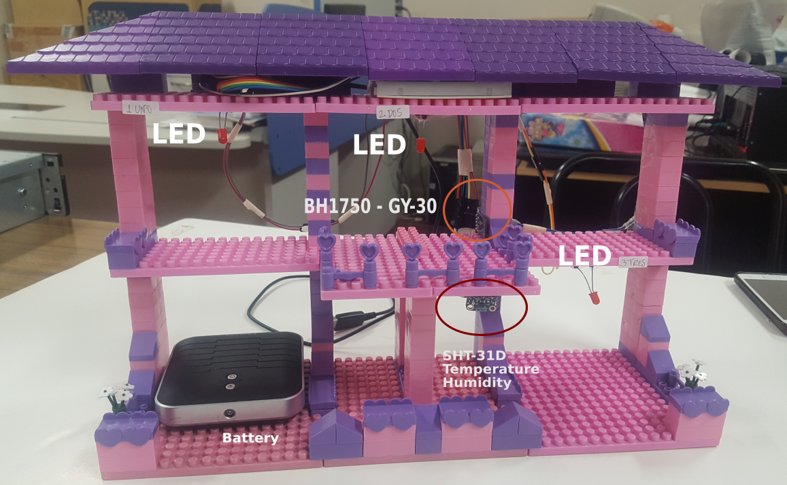
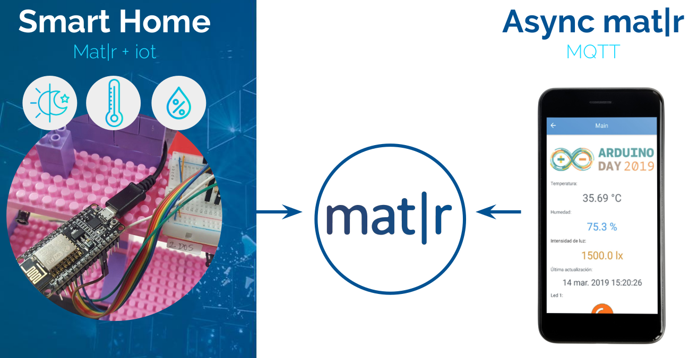

# SmartHome

## Código del prototipo SmartHome

Código de maqueta SmartHome, prototipo de casa manejada de forma remota, presentado en eventos Arduino Day 2019 en Mendoza y Buenos Aires.

En este proyecto se realiza una app en Mat|r llamada SmartHome que recibe información de sensores y puede prender/apagar las luces de la maqueta

Si quieres conocer más sobre el modelo de Arduino utilizado y como fueron conectados los sensores, lee este archivo [README](NodeMCU-app/README.md).
matr-app
La aplicación Mat|r puede encontrarse para libre uso y copia en el Mat|r hub. Puedes ver el código de la aplicación en [el directorio matr-app](img/esquema.png) de este repositorio. Por favor lee el archivo [README](matr-app/README.md) del directorio matr-app para tener más información sobre la conectividad MQTT.

## Code for SmartHome prototype project. 

If you want to know more about which arduino was used and how the sensors were connected, refer to this README file

The Mat|r application can be found in Mat|r hub for free use. You can see the code in the matr-app folder. Please read the matr-app README file to get more information about the MQTT configs.

## Autor

* **Ana Diedrichs** -@anadiedrichs
* **Ariel Verdejo** -@arielverdejo

## License

This project is licensed under the MIT License. 

