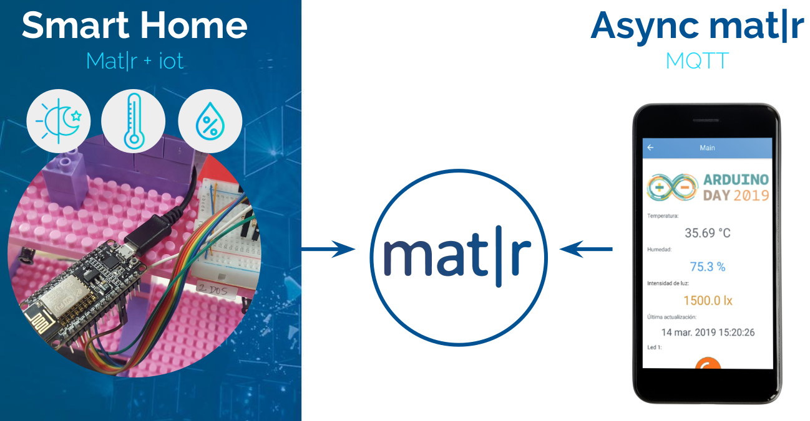
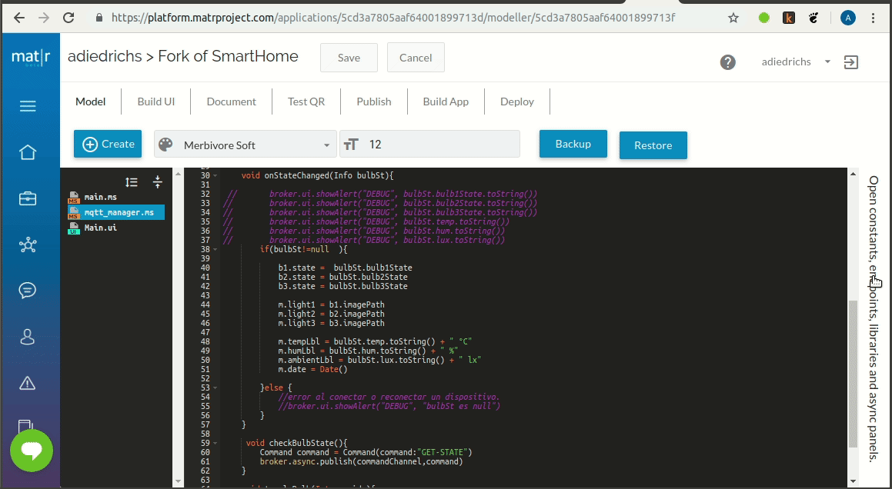
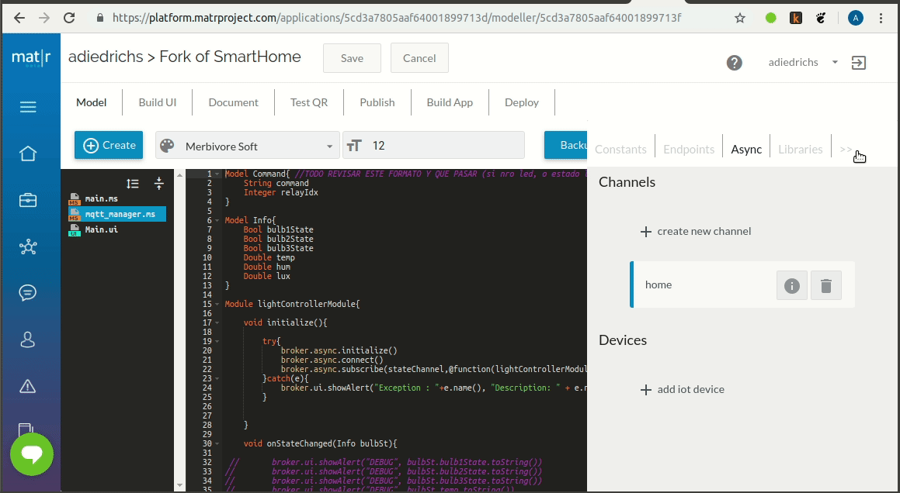
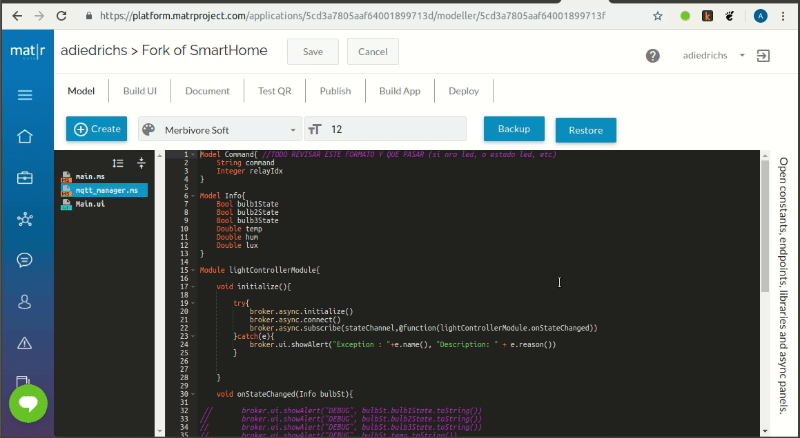

# Smart home

Smart home prototype for Arduino Day 2019 demo.

## Architecture



NodeMCU -- publish sensor status --> channel home (temperature, humidity, light intensity,etc) 

SmartHome app ---> suscribed to (hear) channel home ---> update APP status: values of sensors (temperature, humidity, ligth intensity), timestamp ( at what time the info was received), LEDs status.

SmartHome app -- publish commands to --> channel command  (LED on/off), every time you click on one Bulb button

NodeMCU --> suscribed to (hear) channel command --> turn on/off LEDs according to the command received.

## Prerequisites

* Create a Matr account [in the following page](https://platform.matrproject.com/sign-up)
* Activate your Matr account (¿click en email?)
* Download Matr Viewer app to your mobile phone.

## Fork SmartHome app

Look for SmartHome app in Matr Hub (click in **A**), look for SmartHome app (see **B**), then fork the project SmartHome (click in **C**)


## Create the MQTT channels

You can follow [these steps](http://matrproject.com/docs/eng/async-channels-eng/) to create two async channels which call home and command.






## Create device 




* Create a device and download certificates.
* [Read this](../NodeMCU-app/Configuracion-IDE-Arduino/README.md#spiffs-spi-flash-file-system) to setup the certificates in your Node MCU device.

## Testing the app with mosquitto

Si quieres probar la aplicación sin tener aún tu hardware terminado, puedes usar mosquitto client para simular tu dispositivo. Mosquitto client es una aplicación que se comporta como un cliente MQTT. Puedes descargar [mosquitto client desde este enlace](https://mosquitto.org/download/)

### Example of publication with mosquitto client

MQTT server and port : a2sq3y7mdrjtom.iot.us-east-1.amazonaws.com:8883

MQTT topic (channel home): 3e873641

JSON format:

{"bulb1State":0,"bulb2State":1,"bulb3State":1,"temp":30,"hum":60,"lux":60}

```
mosquitto_pub -h a2sq3y7mdrjtom.iot.us-east-1.amazonaws.com -p 8883 -t 3e873641 --cert testDevice.certificate.pem --key testDevice.private-key.txt --cafile rootCA.pem -m '{"bulb1State":"true","bulb2State":"true","bulb3State":"true","temp":30,"hum":60,"lux":60}' -d

```

### Example of suscription with mosquitto client

MQTT topic (channel command) : a152175c

```
mosquitto_sub -h a2sq3y7mdrjtom.iot.us-east-1.amazonaws.com -p 8883 -t a152175c --cert testDevice.certificate.pem --key testDevice.private-key.txt --cafile rootCA.pem -d
```

## Acknowledgments

* This app was inspired in My Light Control app developed by Matr team
* Matr Async documentation 
